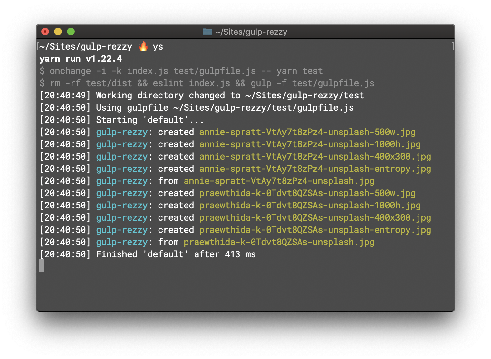

<hr>

[](https://www.npmjs.com/package/gulp-rezzy)
[](https://www.npmjs.com/package/gulp-rezzy)
[](https://github.com/nodejs/Release)
[](https://david-dm.org/robinloeffel/gulp-rezzy)
[](license)

> The incredibly fast image resizer for [`gulp`](https://github.com/gulpjs/gulp). ⚡️

`gulp-rezzy` enables you to resize your images and then pipe each and every newly created version version of it into your stream. This allows you to only have one big background image asset in your source directory and then generate several smaller versions of it for all your responsiveness needs automatically. No more Photoshop for you, my friend!

## Setup

```sh
yarn add gulp-rezzy --dev
```

```js
const { src, dest } = require('gulp');
const rezzy = require('gulp-rezzy');

const images = () => src('source/img/*')
  .pipe(rezzy([{
    width: 640,
    suffix: '-sm'
  }, {
    width: 1280,
    suffix: '-md'
  }, {
    width: 1920,
    suffix: '-lg'
  }]))
  .pipe(dest('public/img'));

module.exports.images = images;
```

This plugin works perfectly in tandem with [`gulp-imagemin`](https://github.com/sindresorhus/gulp-imagemin) and [`gulp-webp`](https://github.com/sindresorhus/gulp-webp).

## Config

You can configure `gulp-rezzy` by passing in an array of objects containing the details of the versions to be generated.

[`width`](#width) and [`height`](#height) are optional. If none of them are supplied, there'll be no resizing. If one of them is present, the image will be transformed accordingly, preserving the aspect ratio. If both are present, the image will be resized and cropped to those exact dimensions. [`suffix`](#suffix) is always required. If no configuration gets passed, no transformations will be made.

You can see all available options for [`fit`](#fit) and [`position`](#position) in the [`sharp` documentation](https://sharp.pixelplumbing.com/api-resize#resize) or in the [`types` file](types/index.d.ts). They get passed right to [`sharp`](https://github.com/lovell/sharp).

### `width`

Type: `number`<br>
Default: `undefined`

Desired width of the image in pixels. Either [`width`](#width) or [`height`](#height) has to be set.

### `height`

Type: `number`<br>
Default: `undefined`

Desired height of the image in pixels. Either [`height`](#height) or [`width`](#width) has to be set.

### `fit`

Type: `string`<br>
Default: `'cover'`

How the image should fit inside the specified dimensions.

### `position`

Type: `string`<br>
Default: `'center'`

What or where to focus on when cropping is necessary.

### `suffix`

Type: `string`<br>
Default: `undefined`

String to prepend the file extension.

## Thanks

This plugin makes strong use of [`sharp`](https://github.com/lovell/sharp) under the hood. Big props to them! Other than that: Shoutout to [`chalk`](https://github.com/chalk/chalk), and of course the [gulp team](https://github.com/gulpjs) for [`gulp`](https://github.com/gulpjs/gulp), [`fancy-log`](https://github.com/gulpjs/fancy-log), [`plugin-error`](https://github.com/gulpjs/plugin-error) and [`vinyl`](https://github.com/gulpjs/vinyl)! Special thanks go out to [Sindre Sorhus](https://github.com/sindresorhus) for getting me on the right track in regards to writing a gulp plugin!

## License

MIT
